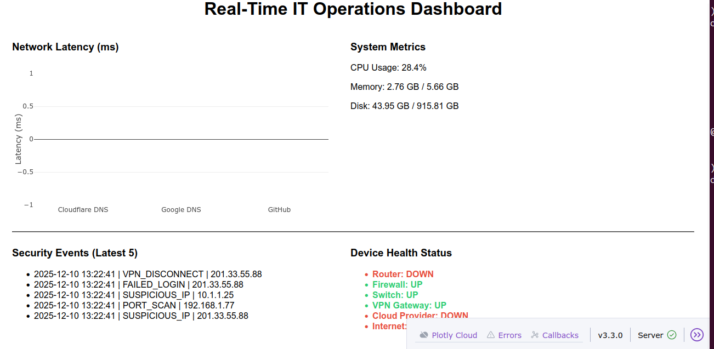

# DashboardPOC1  
### Real-Time IT Operations Monitoring Dashboard  
**Technologies:** Python, Dash, Plotly, psutil, pythonping  
**Author:** Carlos Diaz  

---

## 📌 Overview  
DashboardPOC1 is a **real-time IT Operations Dashboard** designed to simulate and visualize the health of a modern network environment.  
It demonstrates the core skills expected of a **Network Engineer, Cloud Engineer, NOC Analyst, or SRE**, including:

- Network latency monitoring  
- System performance metrics  
- Security event feed  
- Device health status modeling  
- Real-time updates every 5 seconds  
- Modular architecture following real production patterns  

This project was built as a **portfolio-ready Proof of Concept (POC)** to showcase engineering ability, dashboard development, and operational awareness.

---

## 🖼 Example Screenshot

Below is an example screenshot of the dashboard running locally:

---

## 🚀 Features

### ✔ **1. Network Latency Monitoring**
Pings multiple external endpoints (Google DNS, Cloudflare, GitHub).  
Displays color-coded latency bars for:

- **UP** (Green)  
- **DEGRADED** (Yellow)  
- **DOWN** (Red)

---

### ✔ **2. System Metrics (Local Machine)**
Uses `psutil` to capture:

- CPU usage  
- Memory consumption  
- Disk utilization  

Refreshes automatically every 5 seconds.

---

### ✔ **3. Security Event Feed (Simulated)**
Generates rotating, realistic security events such as:

- FAILED_LOGIN  
- FIREWALL_BLOCK  
- PORT_SCAN  
- VPN_DISCONNECT  

Useful for demonstrating log ingestion, alerting concepts, and SOC-style event visibility.

---

### ✔ **4. Device Health Panel**
Aggregates multiple signals to determine operational status for:

- Router  
- Firewall  
- Switch  
- VPN Gateway  
- Cloud Provider  
- Internet  

Statuses are color-coded:

- **Green** → UP  
- **Yellow** → DEGRADED  
- **Red** → DOWN  

---

## 🏗 Project Structure

DashboardPOC1/
│
├── app.py
├── README.md
│
├── modules/
│ ├── latency.py
│ ├── system_metrics.py
│ ├── security_feed.py
│ └── device_health.py
│
├── test_latency.py
├── test_system.py
├── test_security.py
├── test_health.py
│
└── venv/ (ignored)

---

## ▶️ How to Run Locally

### 1. Install dependencies  
pip install -r requirements.txt

### 3. Open your browser  
http://127.0.0.1:8050/

The dashboard will refresh automatically every 5 seconds.

---

## 🎯 Purpose of this Project

This dashboard was designed to:

- Demonstrate real-time data handling  
- Build a visually appealing, functional IT monitoring tool  
- Showcase operational engineering knowledge  
- Serve as a **portfolio project for job applications**  
- Prepare for roles in:
  - Network Engineering  
  - Cloud Operations  
  - NOC/SOC  
  - Site Reliability Engineering  
  - DevOps  
  - MSP technical support roles  

---

## ⭐ Future Enhancements (v2 Ideas)

- Add time-series historical charts  
- SNMP polling for real routers/switches  
- Cloud provider API checks (AWS, Azure, GCP)  
- Export project as a Docker container  
- Store event logs in SQLite or Redis  
- Add authentication  
- Dark mode UI theme  

---

## 📬 Contact  
**Carlos Diaz**  
📧 cmdiazjr@gmail.com  
🔗 linkedin.com/in/carlos-diaz-networkcloud  

---

### ⭐ If you found this project helpful, please star the repository!

